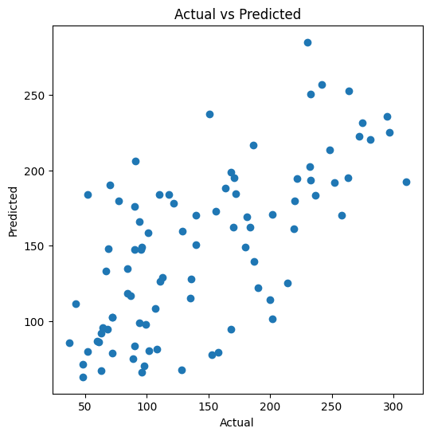
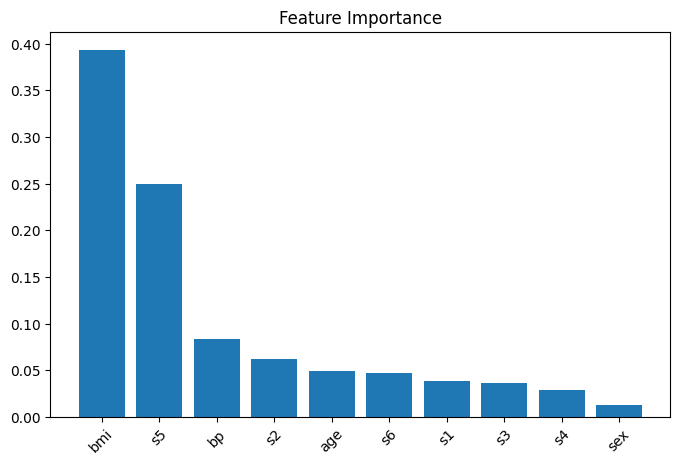

# 🧠 Diabetes Progression Prediction System

A machine learning project that predicts diabetes disease progression using patient medical attributes. The project demonstrates an end-to-end regression workflow with model evaluation and feature interpretation.

---

## 📌 Project Overview

This project focuses on building a machine learning model to predict a continuous diabetes progression score using medical data.

The workflow includes:
- Data loading and preprocessing
- Exploratory Data Analysis (EDA)
- Training a baseline model
- Improving performance using advanced regression techniques
- Model evaluation using standard metrics
- Feature importance analysis and visualization

---

## 📊 Dataset Information

- Source: `sklearn.datasets.load_diabetes()`
- Samples: 442 patients
- Features: 10 medical attributes (age, BMI, blood pressure, etc.)
- Target: Quantitative measure of diabetes progression after one year

---

## 🛠️ Tech Stack

- Python
- NumPy
- Pandas
- Matplotlib
- Scikit-learn

---

## 🤖 Machine Learning Models Used

- Linear Regression (Baseline Model)
- Gradient Boosting Regressor (Final Model)

> Several models were experimented with during development, and Gradient Boosting was selected based on better performance.

---

## 📈 Model Performance

Final selected model: **Gradient Boosting Regressor**

- R² Score: ~0.45  
- MAE: ~44  
- RMSE: ~54  

These metrics indicate moderate predictive performance on a small medical dataset.

---

## 📊 Visualizations

### 📌 Actual vs Predicted Values



This plot shows the relationship between actual and predicted diabetes progression values.

---

### 📌 Feature Importance



This plot highlights the most influential medical features affecting diabetes progression predictions.

---

## ⚙️ Project Workflow

1. Load diabetes dataset from Scikit-learn  
2. Perform exploratory data analysis  
3. Split data into training and testing sets  
4. Train Linear Regression model (baseline)  
5. Train Gradient Boosting Regressor (final model)  
6. Evaluate model performance using R², MAE, RMSE  
7. Perform feature importance analysis  
8. Visualize results  

---

## 🎯 Key Learnings

- Understanding regression-based machine learning problems  
- Model training and evaluation techniques  
- Ensemble learning (Gradient Boosting)  
- Feature importance interpretation  
- End-to-end ML pipeline development  

---

## 🚀 How to Run This Project

### Install dependencies
```bash
pip install numpy pandas matplotlib scikit-learn
```
### Run notebook
jupyter notebook

👩‍💻 Author

Shruti Singh
B.Tech CSE (AI & ML)
